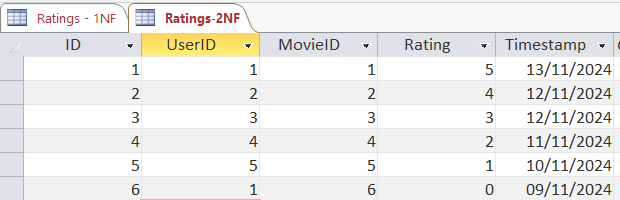
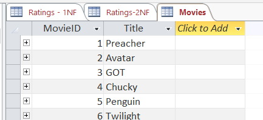
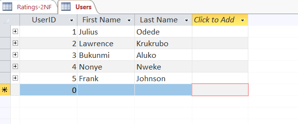
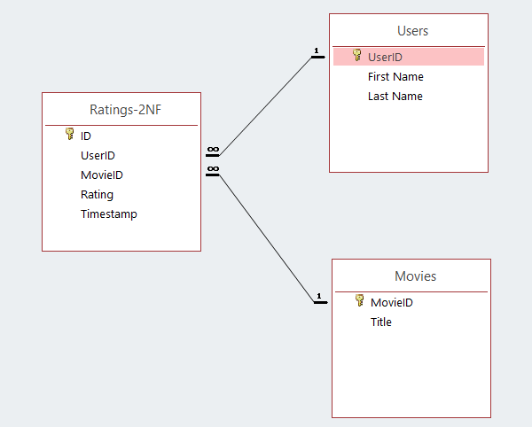

# Understanding-Database-Normalization-with-Microsoft-Access

**Project Overview**

This project explores the process of database normalization, moving from a denormalized table structure to Second Normal Form (2NF), using Microsoft Access as the primary tool. The project focuses on building a movie rating database within a social media context, where users rate various movies.

The goal is to illustrate the value of Microsoft Access in understanding foundational database concepts, such as normalization, and to demonstrate how relational databases can be created, organized, and optimized efficiently.

**Motivation**

Microsoft Office Suite, particularly Microsoft Access, is often undervalued in the data science and database management world. Many data professionals are quick to transition to Python, R, and large-scale DBMS tools, often overlooking the power of foundational tools like Access. In reality, Microsoft Access provides an accessible way to grasp complex database concepts, making it a fantastic choice for anyone looking to strengthen their database fundamentals.

**Project Objectives**

-  Demonstrate Denormalization and Normalization: Show the step-by-step transition from a denormalized table structure to a normalized one, specifically moving to 1NF and 2NF.

-  Illustrate Relationships and Keys: Showcase how using primary keys and foreign keys enables efficient data referencing.

-  Highlight Microsoft Access: Underscore the value of Microsoft Access for building relational databases and understanding core data concepts, especially for beginners.

**Database Structure**

**Denormalized Table**: The initial denormalized table combines all movie ratings and usernames in a single table. This structure, while simple, is prone to data redundancy and inconsistency.

**First Normal Form (1NF)**: In the first normalization stage, each entry in a column contains atomic (indivisible) values, and repetitive groups are eliminated.

**Second Normal Form (2NF)**: By moving to 2NF, we eliminate partial dependencies. Here, non-key attributes are made fully dependent on the primary key, improving data integrity.

**Movies Table**: The Movies table uses a primary key (MovieID) to uniquely identify each movie, which is then referenced in the main ratings table.

**Users Table**: The Users table contains unique user information, linked through UserID.

**Relationships**: The relationships diagram shows a one-to-many relationship, linking tables through primary and foreign keys to enforce data consistency.

**Key Learnings**

-    Normalization Simplifies Data Management: By breaking down data into normalized forms, redundancy is minimized, and data integrity is improved.

-   Microsoft Access is Powerful for Learning: Using Access to create, visualize, and modify relationships allows for a clearer understanding of database structures, making it an excellent choice for beginners.

-  Relational Database Concepts: Concepts such as 1NF and 2NF, primary keys, and foreign keys become more tangible when working with an interactive tool like Access.

**Conclusion**
This project emphasise the power of Microsoft Access as an educational tool, allowing data scientists and analysts to grasp fundamental database concepts before transitioning to larger DBMS platforms. By learning normalization and relationship management in Access, professionals can develop a strong database foundation, enhancing their ability to design efficient, scalable databases in more complex systems.

**Future Directions**

Future projects could involve further normalization (3NF), exploring Microsoft Access's query capabilities, and implementing additional functionality for improved data insights.
